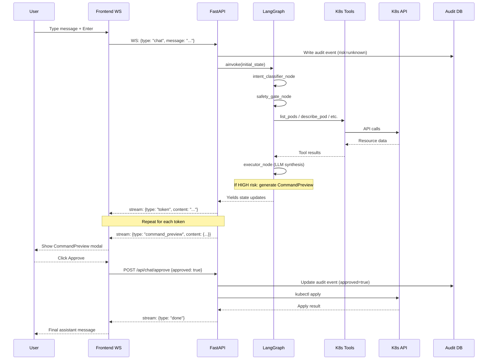
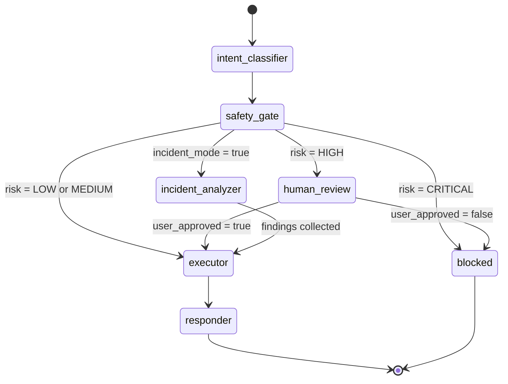
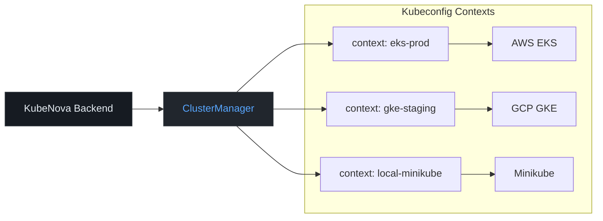

# Architecture

System design, LangGraph state machine, data flows, and architectural design decisions for KubeNova.

---

## 1. System Architecture

```mermaid
graph TB
    subgraph Browser
        UI[React 18 SPA]
        WS_Client[WebSocket Client]
    end

    subgraph Nginx
        Proxy[Reverse Proxy]
    end

    subgraph FastAPI
        REST[REST Endpoints]
        WSEndpoint[WS Endpoints]
        AuditDB[(SQLite Audit Log)]
    end

    subgraph LangGraph Agent
        IC[intent_classifier]
        SG[safety_gate]
        EX[executor_node]
        RN[responder_node]
        HR[human_review]
        BL[blocked]
        IA[incident_analyzer]
    end

    subgraph LLM Backends
        Anthropic[Anthropic Claude]
        OpenAI[OpenAI GPT]
        Ollama[Ollama Local]
    end

    subgraph Kubernetes
        ClusterA[Cluster A - EKS]
        ClusterB[Cluster B - GKE]
        ClusterC[Cluster C - On-prem]
    end

    UI -->|HTTP| Proxy
    WS_Client -->|WS| Proxy
    Proxy --> REST
    Proxy --> WSEndpoint
    REST --> LangGraph Agent
    WSEndpoint --> LangGraph Agent
    REST --> AuditDB
    EX --> Anthropic
    EX --> OpenAI
    EX --> Ollama
    EX -->|kubernetes SDK| Kubernetes
    REST --> AuditDB
```

---

## 2. Chat Request Flow



---

## 3. LangGraph State Machine



---

## 4. Multi-Cluster Architecture



---

## Design Decision Log

### Why LangGraph over a simple chain?

LangGraph was chosen over a linear LangChain chain for three reasons:

1. **Stateful routing**: The safety gate needs to branch based on risk level (LOW → executor, HIGH → human_review, CRITICAL → blocked). LangGraph's conditional edges express this naturally; a chain cannot branch.

2. **Resumable execution**: The command approval flow requires the graph to pause after generating a preview, wait for a user decision over the WebSocket, and resume. LangGraph's interrupt/resume mechanism (via `user_approved` in state) handles this cleanly.

3. **Incident response mode**: The incident_analyzer node runs a structured multi-step investigation before handing off to the executor for synthesis. Composing this as a DAG is more readable and testable than a nested chain.

### Why SQLite for the audit log (MVP)?

SQLite with aiosqlite provides zero-infrastructure persistence that works in a single Docker container. The audit log is append-only and small (one row per user interaction). Migrating to PostgreSQL requires only changing `KUBENOVA_DATABASE_URL` to a `postgresql+asyncpg://` URL — the SQLModel table definitions are database-agnostic.

### Why WebSocket over SSE for chat streaming?

Server-Sent Events (SSE) are unidirectional: the server pushes, the client cannot respond on the same connection. KubeNova's command approval flow requires bidirectional communication: the server sends a `command_preview` chunk, then waits for an `approval` message from the client. WebSocket handles this natively. SSE would require a separate REST endpoint for approvals and complex state correlation.

### Why kubeconfig passthrough instead of custom auth?

Kubernetes has a mature, well-understood credential system in kubeconfig. Re-implementing cluster authentication would introduce security risk and maintenance burden. KubeNova reads the host's kubeconfig (mounted read-only at `/kube` in Docker — not `/root/.kube`, because the backend runs as non-root user `kubenova`), uses the existing context credentials, and adds its own audit layer on top. This means RBAC on the cluster side is the source of truth for what KubeNova can do — the service account in the Helm chart grants only the minimum required permissions.

### Frontend state management split

- **Zustand** for global UI state (chat messages, cluster selection, LLM config) — synchronous, simple, no boilerplate.
- **TanStack Query** for server state (pods, deployments, etc.) — handles caching, refetching intervals, and stale-while-revalidate automatically.
- The two are deliberately kept separate: Zustand never caches server data; TanStack Query never holds UI state.
